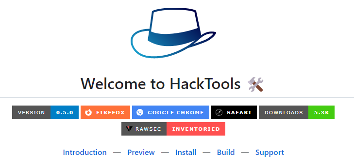
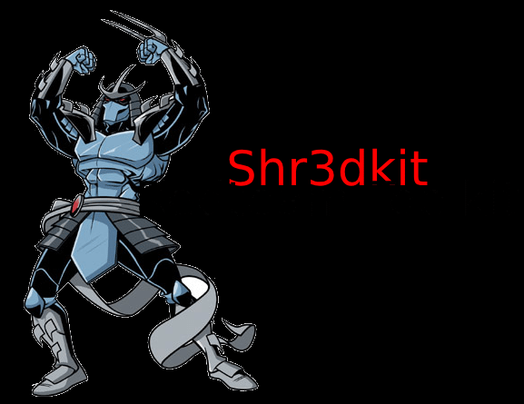
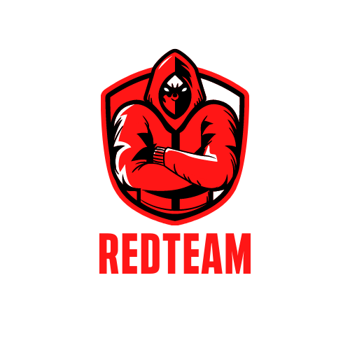

# Resources

Gather Red Team Resources

- [A-poc/RedTeam-Tools](https://github.com/A-poc/RedTeam-Tools):Tools and Techniques for Red Team / Penetration Testing

- [infosecn1nja/Red-Teaming-Toolkit](https://github.com/infosecn1nja/Red-Teaming-Toolkit):This repository contains cutting-edge open-source security tools (OST) for a red teamer and threat hunter.
- [LasCC/Hack-Tools](https://github.com/LasCC/Hack-Tools):The all-in-one Red Team extension for Web Pentester 🛠

- [lengjibo/RedTeamTools](https://github.com/lengjibo/RedTeamTools):记录自己编写、修改的部分工具

- [shr3ddersec/Shr3dKit](https://github.com/shr3ddersec/Shr3dKit):This tool kit is very much influenced by infosecn1nja's kit. Use this script to grab majority of the repos.

- [bigb0sss/RedTeam-OffensiveSecurity](https://github.com/bigb0sss/RedTeam-OffensiveSecurity):Tools & Interesting Things for RedTeam Ops

- [threatexpress/red-team-scripts](https://github.com/threatexpress/red-team-scripts):A collection of Red Team focused tools, scripts, and notes

- [outflanknl/RedELK](https://github.com/outflanknl/RedELK):Red Team's SIEM - tool for Red Teams used for tracking and alarming about Blue Team activities as well as better usability in long term operations.

- [zan8in/afrog](https://github.com/zan8in/afrog):A Security Tool for Bug Bounty, Pentest and Red Teaming.

- [DavidProbinsky/RedTeam-Physical-Tools](https://github.com/DavidProbinsky/RedTeam-Physical-Tools):Red Team Toolkit - A curated list of tools that are commonly used in the field for Physical Security, Red Teaming, and Tactical Covert Entry.

- [RistBS/Awesome-RedTeam-Cheatsheet](https://github.com/RistBS/Awesome-RedTeam-Cheatsheet):Red Team Cheatsheet in constant expansion.

- [signorrayan/RedTeam_toolkit](https://github.com/signorrayan/RedTeam_toolkit):Red Team Toolkit is an Open-Source Django Offensive Web-App which is keeping the useful offensive tools used in the red-teaming together.

- [mgeeky/Penetration-Testing-Tools](https://github.com/mgeeky/Penetration-Testing-Tools):A collection of more than 170+ tools, scripts, cheatsheets and other loots that I've developed over years for Red Teaming/Pentesting/IT Security audits purposes.
